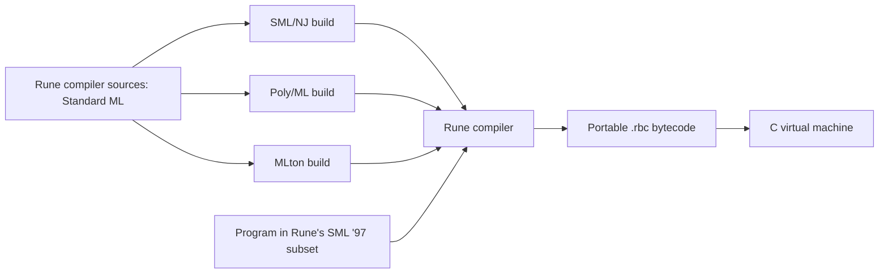

# Rune implementation plan

Status: M0 and M1 complete. M2–M5 remain planned.

## Implementation checkpoint — 2026-09-15

Rune 0.0.1 builds with all three installed host compilers, emits bytecode v1,
and runs on the C VM. [BUILD.md](BUILD.md) contains the current commands and host
workarounds; [LANGUAGE.md](LANGUAGE.md) records verified support.

Validation completed:

- `make test-all`: 73 language fixtures under each host, identical bytecode and
  rejection diagnostics, 12 programs matching all three reference SML compilers,
  and 78 malformed-bytecode/runtime fixtures.
- `make test-builds`: all three hosts build from a checkout path containing
  spaces; incremental builds, source changes, and compilation failures propagate
  correctly.
- `make test-sanitize`: GCC address/undefined-behavior checks pass for the VM.
- `make doctor`, `make check-docs`, and shell/Python syntax checks pass.

Implementation choices for M1: scope resolution, monomorphic type checking, and
instruction construction share an in-memory pass; files are emitted only after
that pass succeeds. General typed-core lowering and closure conversion remain
M2 work. Built-in function values can already be aliased and selected by `if`.
The bytecode has one implicit entry function, forward branches, explicit source
positions, and an arena reclaimed at exit. No user-defined functions or GC yet.

Opcode definitions, support tables, and executable example inclusions are checked
against their source specifications. CI is configured to run the three-host,
packaging, and sanitizer checks; the remote CI run has not been observed. Only
x86-64 Linux/GCC has been validated locally.

## 1. Deliverable and scope

Build a compiler named Rune in portable Standard ML. The same compiler sources
must build using SML/NJ, Poly/ML, and MLton. Each resulting Rune compiler translates
the documented SML ’97 subset into the same deterministic `.rbc` bytecode, which
runs on an independently built C VM.



Here, building with three compilers means **host compiler portability**. Bytecode
provides target portability: the same `.rbc` file runs wherever Rune's C VM is
built. Cross-compiling the C VM can use the target platform's C toolchain; Rune
does not initially need to emit native machine code or compile its own sources.

Full SML ’97, its module system, and broad Basis Library support are beyond a
credible first-session commitment. Aim for M0–M1 in the first implementation
session. M2–M4 produce a useful v0.1 functional language over subsequent work.
Every intermediate delivery must state its actual language support.

The authoritative scope is [LANGUAGE.md](LANGUAGE.md). The language Definition
and Basis Library are separate conformance references; supporting part of the
language does not imply implementing the entire Basis.

## 2. Environment findings

Inspected on 2026-09-15. The starting repository contained only a placeholder
README. The following are local observations, not minimum-version promises:

| Tool | Installed version | Smoke-test result |
| --- | --- | --- |
| SML/NJ | 110.79 | `ml-build` produced a heap image; the underlying SML/NJ launcher ran it successfully outside the execution sandbox |
| Poly/ML | 5.7.1 | A saved compiler state loaded and executed successfully with `poly --script` |
| MLton | 20210117 package | Compiled an MLB project to a working native executable |
| C compiler | GCC 13.3.0 | Available; a Rune VM has not yet been built |
| Make | GNU Make 4.3 | Available |

The SML smoke program shared one source file, converted `2147483647` through
`IntInf`, and checked command-line argument preservation. All three working
launch methods printed the same result, including an argument containing spaces.
These probes validate the host strategy, not an unimplemented Rune build.

Details to handle in M0:

- SML/NJ is stopped with `Bad system call` in this session's sandbox; it runs
  outside it. Treat this as an execution-environment constraint, and report it
  accurately when checks cannot run.
- The local `/usr/bin/sml` script forwards unquoted `$@`, splitting arguments
  containing spaces. `/usr/lib/smlnj/bin/sml` preserves them. Support an explicit
  `SML` path override and make the doctor check detect this launcher issue;
  discover a working underlying launcher where possible. Do not edit system
  scripts or hard-code this distribution's path as a universal location.
- `polyc` is installed but native linking fails with `cannot find -lpolyml`.
  The versioned runtime library is present; the development linker library is
  absent. Use a saved-state build by default so the existing installation works.
  Native Poly/ML export can be an optional build mode when its linker dependencies
  are available. See the official [saved-state API](https://www.polyml.org/documentation/Reference/PolyMLSaveState.html)
  and [object export API](https://polyml.org/documentation/Reference/PolyMLStructure.html).
- On this Poly/ML version, `CommandLine.arguments()` includes `--script` and the
  script filename. The Poly/ML adapter must remove its own launch arguments
  while preserving Rune arguments, including spaces and leading dashes.

## 3. Build and command-line contract

Implement a Makefile and small POSIX shell scripts; no parser generator,
third-party SML library, or package download should be required for ordinary
builds. Use the installed host compiler, its Basis Library, Make, and a C compiler.

Implemented commands (see BUILD.md for the complete interface):

```sh
make doctor                       # Report versions, launch checks, dependencies
make HOST=mlton build              # Default HOST; compiler plus C VM
make HOST=smlnj build
make HOST=polyml build
make all-hosts                     # Require and build all three; fail if missing
make HOST=polyml test              # Test one host's Rune and the VM
make test-all                      # All hosts, bytecode comparison, docs checks
make check-docs                    # Feature coverage, examples, generated docs
make clean                        # Remove only project build artifacts

build/mlton/rune -o build/hello.rbc examples/hello.sml
build/vm/rune-vm build/hello.rbc
build/mlton/rune --check examples/hello.sml
build/mlton/rune --disassemble build/hello.rbc
```

Outputs go under `build/smlnj/`, `build/polyml/`, `build/mlton/`, and `build/vm/`.
All launchers have the same CLI and work from outside the repository directory.
Preserve the caller's working directory when resolving input and output paths.
Support `--` for filenames starting with a dash. Write bytecode only after
successful checking, using a temporary file and replacement so failures leave
no partial output. Reserve stdout for requested output and stderr for diagnostics.
Exit successfully with status zero and use documented nonzero statuses on failure.

Host adapters:

| Host | Build mechanism | Runtime artifact |
| --- | --- | --- |
| SML/NJ | `ml-build` with a CM group and `Main.main : string * string list -> OS.Process.status` | Heap image plus launcher using the matching SML/NJ runtime |
| Poly/ML | Load the ordered sources and call `PolyML.SaveState.saveState`; fail the build on compilation errors | Saved state plus a small `poly --script` loader that invokes `Main.main` |
| MLton | `mlton -output ...` with an MLB file and an entry point calling `OS.Process.exit` | Native executable |

Use one ordered source manifest to produce the CM, MLB, and Poly/ML input files
under the build directories. Keep shared source initialization free of CLI
effects; entry points run only when the user launches Rune. Poly/ML saved states
and SML/NJ images are host/runtime-specific artifacts and must be rebuilt after
changing the host installation. The emitted Rune bytecode has no such dependency.

SML/NJ's build mechanism is documented in its [Compilation Manager manual](https://smlnj.cs.uchicago.edu/doc/CM/new.pdf).
MLton's MLB invocation is documented in its [manual page](https://www.mlton.org/ManualPage).

Support tool overrides such as `SML`, `ML_BUILD`, `POLY`, `MLTON`, `CC`, and
`CFLAGS`. A failed compiler invocation must fail Make; merely starting an
interactive compiler or creating an empty artifact must never count as success.

## 4. Compiler architecture

Use a small handwritten lexer and recursive-descent parser, with precedence
parsing for expressions. Preserve source spans through each compiler phase.

1. **Lexing:** token kinds, identifier spelling, literal values, nested comments,
   string escapes, and line/column tracking. Diagnose unsupported reserved forms.
2. **Parsing:** SML syntax for the current subset, complete-input checking, and
   explicit precedence/associativity. Record binding and expression spans.
3. **Name resolution:** lexical scopes, shadowing, stable binding identities, and
   built-in bindings. Recognized but unsupported syntax receives a useful error.
4. **Type checking:** begin with first-order type checking in M1. Add unification,
   occurs checks, type schemes, equality constraints, and SML's value restriction
   when polymorphic functions arrive. Reject errors before bytecode emission.
5. **Lowering:** translate typed syntax into a small core with explicit bindings,
   branches, primitives, and, in M2, closures and function calls. Preserve SML
   evaluation order. Avoid optimization until the baseline behavior is tested.
6. **Closure conversion:** identify free variables, assign environment slots,
   represent self-recursion, and mark tail calls. Curried functions use unary
   application; partial application produces closures.
7. **Bytecode emission:** assign deterministic constants, function IDs, local
   slots, and labels; resolve jumps; serialize explicitly; include source locations
   for runtime diagnostics. Provide a disassembler for debugging and fixtures.

Use signatures at phase boundaries. Keep host extensions in `host/` or `build/`
adapters. Compiler implementation code may use SML structures, datatypes,
exceptions, and the shared Basis even before Rune accepts those constructs.

Parse target integer literals using host `IntInf`; range-check against Rune's
specified limits before byte encoding. Do not narrow a target integer through
host `Int.int`, since the installed hosts have different integer widths.

Suggested layout, introduced as the corresponding milestone is implemented:

```text
Makefile
sources.list
src/             source positions, lexer, parser, types, core, emit, main
host/            SML/NJ, Poly/ML, and MLton entry points
vm/              bytecode loader, dispatch loop, values, heap, primitives
scripts/         build adapters, test runner, documentation checker
spec/            machine-readable opcode descriptions
docs/            language, builds, bytecode, feature manifest, plan
tests/           accept, reject, runtime, bytecode, host launch checks
examples/        executable examples included in documentation
build/           ignored generated files and artifacts
```

## 5. Bytecode and portable C VM

Use a stack machine with explicit locals and call frames. This keeps the first
emitter and interpreter small and provides a direct path to closures and tuples.

### File format

Specify `docs/BYTECODE.md` before implementing the writer and loader:

- Magic bytes, format version, entry function, section lengths, and declared
  resource limits.
- A constant pool, function metadata, instruction streams, and optional source
  locations. Each function declares its local count and environment size.
- Explicit little-endian integer fields and byte-length-prefixed strings.
  Fixed-width operands initially; no serialized pointers, C structs, SML heap
  values, native-word assumptions, or host-specific marshaling.
- Unknown versions/opcodes are errors. Validate lengths, integer size arithmetic,
  constant/function/local indexes, instruction boundaries, and branch targets.
  Check stack heights across control-flow joins and cap declared resources.
- Keep opcode number, operand shape, and stack effect in one specification.
  Generate or check the SML definitions, C definitions, and opcode documentation
  from it. Freeze opcode numbers only when that specification is reviewed.
- Equivalent builds emit byte-identical files: stable ordering, no timestamps or
  absolute checkout paths. Deliberate incompatible changes increment the format
  version and add compatibility/rejection tests.

Opcode families grow with the language: constants, local/environment access,
stack operations, primitives, jumps, closure construction, calls, tail calls,
returns, tuples, and halt. Do not implement every later opcode in M1.

### Runtime

- Target ISO C11 on systems with 8-bit bytes and exact 32- and 64-bit integer
  types. Check these requirements at build time. Support 32- and 64-bit hosts
  and either endianness; wider platform claims require actual test evidence.
- Use a `switch` dispatch loop and explicit tagged value structs/unions. Avoid
  computed goto, pointer tagging, architecture assembly, and undefined arithmetic.
- Rune `int` is signed 32-bit. Use checked arithmetic, including floor-based
  SML `div`/`mod`, implemented with safe wider intermediates. Handle `Overflow`
  and `Div` explicitly; neither can become C undefined behavior.
- Store strings as byte arrays with lengths, including embedded NUL. Printing
  uses lengths, and `Int.toString` uses SML's `~` negative sign.
- Keep VM frames on an explicit growable stack; a tail call replaces the current
  frame. Ordinary SML recursion must not recurse through C calls.
- M1 may use an allocation arena reclaimed at program exit, with documented
  limits. M3 replaces it with non-moving mark-and-sweep collection for strings,
  tuples, and closures. Trace explicit roots: value stack, frames, environments,
  globals, constants, and temporary C values across allocation points. Use an
  iterative mark worklist and account for closure cycles from recursion.
- Validate runtime value tags and stack operations, even after loading checks.
  Report malformed bytecode and allocation/resource failures with nonzero exit
  status instead of crashing. This is not a claim that v0.1 is a hostile-code
  execution sandbox.
- Ordinary VM code depends only on standard C facilities. Build it without any
  SML runtime dependency. Keep platform packaging and shell scripts outside it.

## 6. Milestones and acceptance gates

M0 and M1 have passed their acceptance gates. M2–M5 remain pending; complete and
document each gate before claiming that its features are implemented.

### M0 — Host builds and documentation foundation (complete)

- Add the shared source manifest, a minimal compiler CLI, all three build
  adapters, the Makefile, `doctor`, and artifact isolation.
- Add a minimal C executable and a test runner with strict failure propagation.
- Establish the feature manifest and documentation checks described in section 8.
- **Gate:** build and launch the shared CLI under all three hosts; verify `--help`,
  `--version`, arguments with spaces, failure statuses, incremental rebuilds, and
  invocation from another directory. Exercise these from a checkout path with
  spaces. A deliberately broken SML source must fail every host's build.

### M1 — First end-to-end compiler (complete)

- Implement the `first-slice` rows of LANGUAGE.md: literals, names, `val`, `let`,
  integer/boolean operations, `if`, short-circuit booleans, sequencing, `print`,
  and `Int.toString`, with static checking.
- Implement only the required bytecode instructions, loader, emitter, and VM.
- Add `--check`, a basic disassembler, source errors, and executable examples.
- **Gate:** compile an arithmetic/conditional/printing example through each host
  build; all three `.rbc` files are identical and produce the expected output on
  the C VM. Include shadowing, false-branch non-evaluation, negative division,
  overflow, string escaping, type errors, and a truncated bytecode rejection.
- **Delivery:** a clearly labeled SML ’97 subset, with no user-defined functions
  yet. Do not stretch this milestone to include modules or self-hosting.

### M2 — Functions and static polymorphism

- Add `fn`, single-clause recursive `fun`, currying, lexical closures, tuples,
  irrefutable binding patterns, and Hindley–Milner inference with the value
  restriction and equality constraints.
- Add calls, environments, returns, structural tuple equality, and tail calls.
- **Gate:** polymorphic identity at two types, a closure capturing a shadowed
  variable, a higher-order function, recursive factorial, tuple destructuring,
  and a long tail-recursive loop. Reject self-application, function equality,
  invalid recursive definitions, and invalid generalization of expansive values.

### M3 — Runtime completion for v0.1

- Add garbage collection, complete bytecode validation for current instructions,
  bounded resource errors, and useful runtime source locations.
- **Gate:** allocation-heavy closure/string/tuple programs run under a small heap;
  dead cyclic closures can be collected; values survive collections at every
  allocation point; malformed instruction/operand/control-flow fixtures fail
  cleanly. Long tail recursion uses bounded frame space.

### M4 — v0.1 release checks

- Finish all v0.1 language rows, grammar, Basis inventory, build instructions,
  bytecode specification, examples, and contributor documentation checks.
- **Gate:** clean `make test-all` succeeds on all three hosts; emitted bytecode
  and diagnostics agree; strict C builds and applicable sanitizer checks pass.
  Run the standalone VM on a second OS or architecture, or state precisely which
  platform combinations remain unverified. Missing coverage is never a pass.
- **Delivery:** portable compiler source, three tested build paths, C VM,
  bytecode tools, documented functional subset, and runnable examples.

### M5 — Expand toward SML ’97; optional self-hosting later

Recommended order, each with its own language documentation and acceptance gate:

1. Lists and user datatypes; constructor patterns, `case`, multi-clause matches,
   `Match`/`Bind`, and match diagnostics.
2. Exceptions and handlers, including exception identity and stack unwinding.
3. References, assignment, `while`, arrays/vectors, and their interaction with
   equality, mutation, garbage collection, and the value restriction.
4. Records and row inference, type declarations/annotations, local declarations,
   user fixity, mutually recursive declarations, and remaining core forms.
5. Broader numeric types and Basis facilities, with explicit implementation limits.
6. Structures, signatures, functors, type identity, sharing, and opaque ascription.
   Treat module elaboration as a separate substantial project.
7. Audit remaining Definition/Basis gaps before any full-conformance claim.
8. Evaluate self-hosting only once Rune accepts the compiler's actual source and
   library dependencies. Then bootstrap from an external host and compare the
   behavior and emitted program bytecode across successive bootstrap stages.

## 7. Validation strategy

Use one fixture corpus across all three host-built Rune compilers:

- **Accept/run:** source, expected stdout, expected exit status, and feature IDs.
- **Reject:** source and stable diagnostic category/span for lexical, syntax,
  scope, type, and explicitly unsupported-feature errors.
- **Runtime:** arithmetic boundaries, evaluation order, shadowing, recursion,
  closure capture, equality, allocation, and runtime failures as features arrive.
- **Bytecode:** canonical disassembly plus truncated/corrupt inputs, invalid
  indexes, branch targets, inconsistent stack heights, and format versions.
- **Cross-host:** compare `.rbc` bytes for the same relative source path and
  options, then compare execution results and diagnostic categories.
- **Reference execution:** run supported SML fixtures directly with SML/NJ,
  Poly/ML, and MLton using adapters that isolate program output from compiler
  banners. Compare specified observable results, not printer formatting.
  Keep ordinary integers in the common host range; test Rune's wider integer
  boundaries against explicit expectations or an `IntInf` reference model.
- **C portability:** strict warnings with GCC and Clang when available; ASan/UBSan
  in a separate test configuration; second-platform execution and 32-bit/big-endian
  checks where available. Byte serialization has explicit golden fixtures even
  when additional architectures are unavailable.

Introduce these checks with the behavior they validate. M0/M1 need a small useful
corpus; later milestones add GC stress and malformed control-flow coverage. CI
must require the three-host matrix, with missing tools reported as failures for
the required job. Local single-host tests remain convenient for development.

## 8. Keep language documentation in sync

The repository's [contributor instructions](../AGENTS.md) require language changes
and documentation/tests to land together. M0 now implements the following
mechanical checks:

1. Create `docs/features.tsv` with stable feature IDs, milestone, status
   (`planned`, `partial`, `implemented`, `deferred`), and a documented boundary.
   Preserve the IDs already listed in LANGUAGE.md.
2. Generate the support-status table in LANGUAGE.md from that manifest; keep
   prose semantics and restrictions in the same document. Check generated output
   for drift. Do not maintain independent handwritten status tables.
3. Associate fixtures with feature IDs. `make check-docs` rejects unknown IDs,
   implemented features without positive and relevant negative/boundary coverage,
   and deferred recognized syntax without a rejection fixture. Partial support
   needs both an accepted example and a rejection of its excluded portion.
4. Keep runnable documentation examples in `examples/` and include or generate
   their code blocks into documentation. Check for drift and run examples under
   all three builds as part of `make test-all`. Label future examples as planned.
5. Include the grammar, operator precedence, built-in types/signatures, integer
   limits, runtime failures, and explicit exclusions in the language contract.
   Update these whenever behavior changes, even if a feature ID stays the same.
6. Check opcode documentation against the common opcode specification. Require
   `make test-all` in CI and document any unavailable platform checks.

These checks detect stale tables, examples, and missing coverage. They cannot
prove prose matches every semantic detail; review must still compare the behavior
change with its documentation. The current contract marks the ten M1 feature rows implemented after their
three-host checks; later rows remain planned or deferred.

## 9. Main risks and decisions

| Risk | Decision |
| --- | --- |
| Scope expands before the first runnable compiler | Deliver M0–M1 first; add functions and GC in explicit later gates |
| Host runtimes leak different semantics into Rune | One portable core, isolated adapters, explicit numeric/bytecode formats, three-host tests |
| Incorrect SML typing hidden by runtime-only checks | Static checking from M1; occurs check, value restriction, and equality constraints with M2 |
| Closures and recursion expose memory bugs | Explicit VM stack/roots; GC and stress tests before v0.1 |
| Documentation overstates compliance | Separate current/planned states, feature IDs, executable examples, required doc updates |
| Packaging differences make a host unusable | Doctor checks, configurable tools, saved-state Poly/ML path, tested SML/NJ argument handling |

The next implementation milestone is M2: user-defined functions, lexical
closures, tuples, recursive calls, and static polymorphism.
