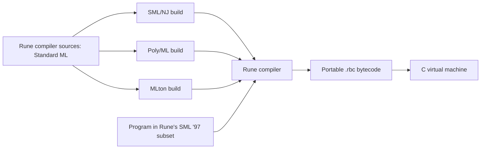

# Rune implementation plan

Status: M0–M4 and M5a complete. Lists and the remaining M5 increments are deferred.

Next session: [M5b lists](#next-session--m5b-lists).

## Implementation checkpoint — 2026-09-16

Rune 0.1.0 completes M4. The implementation is committed as `fed2c2e`; this
checkpoint and the [release notes](RELEASES.md) record its acceptance results.
The language remains the documented M1/M2 functional subset with M3 garbage
collection. M4 adds repeatable portability checks, CI coverage, and synchronized
compiler/VM release versions. Bytecode remains v2 with unchanged encoding and
instruction meanings; existing v2 files run without recompilation.

Validation completed for M4:

- Clean `make test-all`: 133 language fixtures under each of SML/NJ, Poly/ML,
  and MLton, with every runnable fixture executed normally and under GC stress.
  Bytecode and rejection diagnostics are identical. The 33 reference programs
  and 15 type/pattern rejection cases agree with all four reference compilers.
- `make test-portability`: the same bytecode file from each compiler build runs
  on native x86-64 Linux, emulated i386 Linux (32-bit little-endian), and emulated
  PowerPC64 Linux (64-bit big-endian). Stdout, exit status, and full runtime
  diagnostics agree. Each VM passes 372 malformed-bytecode/runtime fixtures in
  each execution mode, plus heap-option, loading-root, and filename CLI checks.
- Native and cross-built collector harnesses pass root categories, stale slots,
  shared/cyclic graphs, a 100,000-object chain, and exact heap accounting.
  Allocation-heavy programs finish with a 16 KiB heap; retained-heap failures
  preserve source locations on every VM. Tail-call fixtures pass on every target.
- Cross-built ELF headers and executing C probes verify architecture, pointer
  width, and byte order. Additional manual checks reject a native ELF file
  presented as either cross target and reject a mismatched runtime pointer width.
  An isolated checkout with apostrophes/spaces also passes the i386 launcher,
  external-working-directory, and option-like-filename checks.
- `make test-builds`: all four hosts pass spaced-checkout, incremental-build,
  changed-source rebuild, and failed-compilation checks.
- `make CC=clang HOST=polyml test`: strict C11 VM/harness builds and the full
  Poly/ML-driven corpus, VM checks, and references pass.
- `make CC=gcc test-sanitize` and `make CC=clang test-sanitize`: collector harness,
  MLton-driven corpus, normal/stress VM checks, and references pass with ASan,
  UBSan, and leak detection enabled outside the sandbox.
- `make doctor`, `make check-docs`, Python syntax checks, and `git diff --check`
  pass. Grammar, feature/Basis inventory, resource limits, GC retention,
  bytecode compatibility, CLI behavior, and examples were reviewed against the
  implementation; no language or instruction changes were needed.

Local toolchains are GCC 13.3.0, Clang 18.1.3, and QEMU 8.2.2 on Ubuntu 24.04
x86-64. The PowerPC64 recipe uses Clang plus installed cross binutils and
libraries, which coexist with GCC multilib. All required tools were available;
no packages or system settings were changed. [BUILD.md](BUILD.md) records exact
setup, artifact locations, and overrides.

SML/NJ suites and leak detection ran outside the execution sandbox using the
previously documented workarounds. Native i386 execution in the sandbox failed
with `Bad system call`; explicit QEMU user emulation worked. These are execution
constraints, not missing packages. The additional VM targets are verified under
emulation; native PowerPC hardware, 32-bit big-endian targets, ARM64, and other
operating systems remain unverified.

[GitHub Actions run for `fed2c2e`](https://github.com/ruudkoot/rune/actions/runs/35030873753)
passed both `compiler-and-vm` and `vm-portability`, including GCC/Clang sanitizer
checks. That observed run covers the implementation; the subsequent release
status/documentation update is checked locally.

## 1. Deliverable and scope

Build a compiler named Rune in portable Standard ML. The same compiler sources
must build using SML/NJ, Poly/ML, MLton, and Moscow ML. Each resulting Rune compiler translates
the documented SML ’97 subset into the same deterministic `.rbc` bytecode, which
runs on an independently built C VM.



Here, building with four compilers means **host compiler portability**. Bytecode
provides target portability: the same `.rbc` file runs wherever Rune's C VM is
built. Cross-compiling the C VM can use the target platform's C toolchain; Rune
does not initially need to emit native machine code or compile its own sources.

Full SML ’97, its module system, and broad Basis Library support are beyond a
credible first-session commitment. Aim for M0–M1 in the first implementation
session. M2–M4 produce a useful v0.1 functional language over subsequent work.
Every intermediate delivery must state its actual language support.

The authoritative scope is [LANGUAGE.md](LANGUAGE.md). The language Definition
and Basis Library are separate conformance references; supporting part of the
language does not imply implementing the entire Basis.

## 2. Initial environment findings (M0)

Inspected on 2026-09-15. The starting repository contained only a placeholder
README. The following are local observations, not minimum-version promises:

| Tool | Installed version | Smoke-test result |
| --- | --- | --- |
| SML/NJ | 110.79 | `ml-build` produced a heap image; the underlying SML/NJ launcher ran it successfully outside the execution sandbox |
| Poly/ML | 5.7.1 | A saved compiler state loaded and executed successfully with `poly --script` |
| MLton | 20210117 package | Compiled an MLB project to a working native executable |
| C compiler | GCC 13.3.0 | Available; a Rune VM has not yet been built |
| Make | GNU Make 4.3 | Available |

The SML smoke program shared one source file, converted `2147483647` through
`IntInf`, and checked command-line argument preservation. All three working
launch methods printed the same result, including an argument containing spaces.
These probes validate the host strategy, not an unimplemented Rune build.

M0 findings addressed by the current build adapters:

- SML/NJ is stopped with `Bad system call` in this session's sandbox; it runs
  outside it. Treat this as an execution-environment constraint, and report it
  accurately when checks cannot run.
- The local `/usr/bin/sml` script forwards unquoted `$@`, splitting arguments
  containing spaces. `/usr/lib/smlnj/bin/sml` preserves them. Support an explicit
  `SML` path override and make the doctor check detect this launcher issue;
  discover a working underlying launcher where possible. Do not edit system
  scripts or hard-code this distribution's path as a universal location.
- `polyc` is installed but native linking fails with `cannot find -lpolyml`.
  The versioned runtime library is present; the development linker library is
  absent. Use a saved-state build by default so the existing installation works.
  Native Poly/ML export can be an optional build mode when its linker dependencies
  are available. See the official [saved-state API](https://www.polyml.org/documentation/Reference/PolyMLSaveState.html)
  and [object export API](https://polyml.org/documentation/Reference/PolyMLStructure.html).
- On this Poly/ML version, `CommandLine.arguments()` includes `--script` and the
  script filename. The Poly/ML adapter must remove its own launch arguments
  while preserving Rune arguments, including spaces and leading dashes.

## 3. Build and command-line contract

Implement a Makefile and small POSIX shell scripts; no parser generator,
third-party SML library, or package download should be required for ordinary
builds. Use the installed host compiler, its Basis Library, Make, and a C compiler.

Implemented commands (see BUILD.md for the complete interface):

```sh
make doctor                       # Report versions, launch checks, dependencies
make HOST=mlton build              # Default HOST; compiler plus C VM
make HOST=smlnj build
make HOST=polyml build
make all-hosts                     # Require and build all four; fail if missing
make HOST=polyml test              # Test one host's Rune and the VM
make test-all                      # All hosts, bytecode comparison, docs checks
make check-docs                    # Feature coverage, examples, generated docs
make clean                        # Remove only project build artifacts

build/mlton/rune -o build/hello.rbc examples/hello.sml
build/vm/rune-vm build/hello.rbc
build/mlton/rune --check examples/hello.sml
build/mlton/rune --disassemble build/hello.rbc
```

Outputs go under `build/smlnj/`, `build/polyml/`, `build/mlton/`, and `build/vm/`.
All launchers have the same CLI and work from outside the repository directory.
Preserve the caller's working directory when resolving input and output paths.
Support `--` for filenames starting with a dash. Write bytecode only after
successful checking, using a temporary file and replacement so failures leave
no partial output. Reserve stdout for requested output and stderr for diagnostics.
Exit successfully with status zero and use documented nonzero statuses on failure.

Host adapters:

| Host | Build mechanism | Runtime artifact |
| --- | --- | --- |
| SML/NJ | `ml-build` with a CM group and `Main.main : string * string list -> OS.Process.status` | Heap image plus launcher using the matching SML/NJ runtime |
| Poly/ML | Load the ordered sources and call `PolyML.SaveState.saveState`; fail the build on compilation errors | Saved state plus a small `poly --script` loader that invokes `Main.main` |
| MLton | `mlton -output ...` with an MLB file and an entry point calling `OS.Process.exit` | Native executable |

Use one ordered source manifest to produce the CM, MLB, and Poly/ML input files
under the build directories. Keep shared source initialization free of CLI
effects; entry points run only when the user launches Rune. Poly/ML saved states
and SML/NJ images are host/runtime-specific artifacts and must be rebuilt after
changing the host installation. The emitted Rune bytecode has no such dependency.

SML/NJ's build mechanism is documented in its [Compilation Manager manual](https://smlnj.cs.uchicago.edu/doc/CM/new.pdf).
MLton's MLB invocation is documented in its [manual page](https://www.mlton.org/ManualPage).

Support tool overrides such as `SML`, `ML_BUILD`, `POLY`, `MLTON`, `CC`, and
`CFLAGS`. A failed compiler invocation must fail Make; merely starting an
interactive compiler or creating an empty artifact must never count as success.

## 4. Compiler architecture

Use a small handwritten lexer and recursive-descent parser, with precedence
parsing for expressions. Preserve source spans through each compiler phase.

1. **Lexing:** token kinds, identifier spelling, literal values, nested comments,
   string escapes, and line/column tracking. Diagnose unsupported reserved forms.
2. **Parsing:** SML syntax for the current subset, complete-input checking, and
   explicit precedence/associativity. Record binding and expression spans.
3. **Name resolution:** lexical scopes, shadowing, stable binding identities, and
   built-in bindings. Recognized but unsupported syntax receives a useful error.
4. **Type checking:** begin with first-order type checking in M1. Add unification,
   occurs checks, type schemes, equality constraints, and SML's value restriction
   when polymorphic functions arrive. Reject errors before bytecode emission.
5. **Lowering:** translate typed syntax into a small core with explicit bindings,
   branches, primitives, and, in M2, closures and function calls. Preserve SML
   evaluation order. Avoid optimization until the baseline behavior is tested.
6. **Closure conversion:** identify free variables, assign environment slots,
   represent self-recursion, and mark tail calls. Curried functions use unary
   application; partial application produces closures.
7. **Bytecode emission:** assign deterministic constants, function IDs, local
   slots, and labels; resolve jumps; serialize explicitly; include source locations
   for runtime diagnostics. Provide a disassembler for debugging and fixtures.

Use signatures at phase boundaries. Keep host extensions in `host/` or `build/`
adapters. Compiler implementation code may use SML structures, datatypes,
exceptions, and the shared Basis even before Rune accepts those constructs.

Parse target integer literals using host `IntInf`; range-check against Rune's
specified limits before byte encoding. Do not narrow a target integer through
host `Int.int`, since the installed hosts have different integer widths.

Suggested layout, introduced as the corresponding milestone is implemented:

```text
Makefile
sources.list
src/             source positions, lexer, parser, types, core, emit, main
host/            SML/NJ, Poly/ML, MLton, and Moscow ML entry points
vm/              bytecode loader, dispatch loop, values, heap, primitives
scripts/         build adapters, test runner, documentation checker
spec/            machine-readable opcode descriptions
docs/            language, builds, bytecode, feature manifest, plan
tests/           accept, reject, runtime, bytecode, host launch checks
examples/        executable examples included in documentation
build/           ignored generated files and artifacts
```

## 5. Bytecode and portable C VM

Use a stack machine with explicit locals and call frames. This keeps the first
emitter and interpreter small and provides a direct path to closures and tuples.

### File format

Specify `docs/BYTECODE.md` before implementing the writer and loader:

- Magic bytes, format version, entry function, section lengths, and declared
  resource limits.
- A constant pool, function metadata, instruction streams, and optional source
  locations. Each function declares its local count and environment size.
- Explicit little-endian integer fields and byte-length-prefixed strings.
  Fixed-width operands initially; no serialized pointers, C structs, SML heap
  values, native-word assumptions, or host-specific marshaling.
- Unknown versions/opcodes are errors. Validate lengths, integer size arithmetic,
  constant/function/local indexes, instruction boundaries, and branch targets.
  Check stack heights across control-flow joins and cap declared resources.
- Keep opcode number, operand shape, and stack effect in one specification.
  Generate or check the SML definitions, C definitions, and opcode documentation
  from it. Freeze opcode numbers only when that specification is reviewed.
- Equivalent builds emit byte-identical files: stable ordering, no timestamps or
  absolute checkout paths. Deliberate incompatible changes increment the format
  version and add compatibility/rejection tests.

Opcode families grow with the language: constants, local/environment access,
stack operations, primitives, jumps, closure construction, calls, tail calls,
returns, tuples, and halt. Do not implement every later opcode in M1.

### Runtime

- Target ISO C11 on systems with 8-bit bytes and exact 32- and 64-bit integer
  types. Check these requirements at build time. Support 32- and 64-bit hosts
  and either endianness; wider platform claims require actual test evidence.
- Use a `switch` dispatch loop and explicit tagged value structs/unions. Avoid
  computed goto, pointer tagging, architecture assembly, and undefined arithmetic.
- Rune `int` is signed 32-bit. Use checked arithmetic, including floor-based
  SML `div`/`mod`, implemented with safe wider intermediates. Handle `Overflow`
  and `Div` explicitly; neither can become C undefined behavior.
- Store strings as byte arrays with lengths, including embedded NUL. Printing
  uses lengths, and `Int.toString` uses SML's `~` negative sign.
- Keep VM frames on an explicit growable stack; a tail call replaces the current
  frame. Ordinary SML recursion must not recurse through C calls.
- M1 and M2 use an allocation arena reclaimed at program exit, with documented
  limits. M3 replaces it with non-moving mark-and-sweep collection for strings,
  tuples, and closures. Trace explicit roots: value stack, frames, environments,
  globals, constants, and temporary C values across allocation points. Use an
  iterative mark worklist and account for closure cycles from recursion.
- Validate runtime value tags and stack operations, even after loading checks.
  Report malformed bytecode and allocation/resource failures with nonzero exit
  status instead of crashing. This is not a claim that v0.1 is a hostile-code
  execution sandbox.
- Ordinary VM code depends only on standard C facilities. Build it without any
  SML runtime dependency. Keep platform packaging and shell scripts outside it.

## 6. Milestones and acceptance gates

M0–M4 and M5a have passed their acceptance gates. The remaining M5 increments
are pending; complete and document each new feature gate before claiming
implementation.

### M0 — Host builds and documentation foundation (complete)

- Add the shared source manifest, a minimal compiler CLI, all four build
  adapters, the Makefile, `doctor`, and artifact isolation.
- Add a minimal C executable and a test runner with strict failure propagation.
- Establish the feature manifest and documentation checks described in section 8.
- **Gate:** build and launch the shared CLI under all four hosts; verify `--help`,
  `--version`, arguments with spaces, failure statuses, incremental rebuilds, and
  invocation from another directory. Exercise these from a checkout path with
  spaces. A deliberately broken SML source must fail every host's build.

### M1 — First end-to-end compiler (complete)

- Implement the `first-slice` rows of LANGUAGE.md: literals, names, `val`, `let`,
  integer/boolean operations, `if`, short-circuit booleans, sequencing, `print`,
  and `Int.toString`, with static checking.
- Implement only the required bytecode instructions, loader, emitter, and VM.
- Add `--check`, a basic disassembler, source errors, and executable examples.
- **Gate:** compile an arithmetic/conditional/printing example through each host
  build; all four `.rbc` files are identical and produce the expected output on
  the C VM. Include shadowing, false-branch non-evaluation, negative division,
  overflow, string escaping, type errors, and a truncated bytecode rejection.
- **Delivery:** a clearly labeled SML ’97 subset, with no user-defined functions
  yet. Do not stretch this milestone to include modules or self-hosting.

### M2 — Functions and static polymorphism (complete)

- Add `fn`, single-clause recursive `fun`, currying, lexical closures, tuples,
  irrefutable binding patterns, and Hindley–Milner inference with the value
  restriction and equality constraints.
- Add calls, environments, returns, structural tuple equality, and tail calls.
- **Gate:** polymorphic identity at two types, a closure capturing a shadowed
  variable, a higher-order function, recursive factorial, tuple destructuring,
  and a long tail-recursive loop. Reject self-application, function equality,
  invalid recursive definitions, and invalid generalization of expansive values.

### M3 — Runtime completion for v0.1 (complete)

- Add garbage collection, complete bytecode validation for current instructions,
  bounded resource errors, and useful runtime source locations.
- **Gate:** allocation-heavy closure/string/tuple programs run under a small heap;
  dead cyclic closures can be collected (tested in the internal C harness);
  values survive collections at every
  allocation point; malformed instruction/operand/control-flow fixtures fail
  cleanly. Long tail recursion uses bounded frame space.

### M4 — v0.1 release checks (complete)

- Finish all v0.1 language rows, grammar, Basis inventory, build instructions,
  bytecode specification, examples, and contributor documentation checks.
- **Gate:** clean `make test-all` succeeds on all four hosts; emitted bytecode
  and diagnostics agree; strict C builds and applicable sanitizer checks pass.
  Run the standalone VM and collector harness on a 32-bit little-endian target
  and a big-endian target in addition to native x86-64 Linux. Record whether
  execution is native or emulated and which other platforms remain unverified.
  Missing coverage is never a pass.
- **Delivery:** portable compiler source, three tested build paths, C VM,
  bytecode tools, documented functional subset, and runnable examples.

M4's gate is complete. `make test-portability` and the CI portability job now
run the full four-host corpus against all four VM targets. The shared runner
accepts repeated `--vm` arguments, so each target executes identical bytecode
and produces comparable runtime diagnostics. Target identity guards and the
collector harness run before the corpus. See the checkpoint above for results
and [BUILD.md](BUILD.md#portability-checks) for commands and dependencies.

### M5 — Expand toward SML ’97; optional self-hosting later

Recommended order, each with its own language documentation and acceptance gate:

1. Lists and user datatypes; constructor patterns, `case`, multi-clause matches,
   `Match`/`Bind`, and match diagnostics. M5a completes user datatypes, `case`,
   refutable patterns, failures, and diagnostics; lists and multi-clause functions
   follow as M5b and M5c.
2. Exceptions and handlers, including exception identity and stack unwinding.
3. References, assignment, `while`, arrays/vectors, and their interaction with
   equality, mutation, garbage collection, and the value restriction.
4. Records and row inference, type declarations/annotations, local declarations,
   user fixity, mutually recursive declarations, and remaining core forms.
5. Broader numeric types and Basis facilities, with explicit implementation limits.
6. Structures, signatures, functors, type identity, sharing, and opaque ascription.
   Treat module elaboration as a separate substantial project.
7. Audit remaining Definition/Basis gaps before any full-conformance claim.
8. Evaluate self-hosting only once Rune accepts the compiler's actual source and
   library dependencies. Then bootstrap from an external host and compare the
   behavior and emitted program bytecode across successive bootstrap stages.

#### M5a — Datatypes and case (complete)

Rune 0.2.0 completes this increment. One datatype per declaration may have
ordinary or equality type parameters, self-recursion, nullary constructors, and
unary constructors with scalar, function, tuple, or datatype payloads. Top-level
and `let` declarations use fresh nominal type identities. Constructor status
follows lexical bindings; ordinary aliases remain values. The type checker
handles datatype equality, constructor applications under the value restriction,
and local type escape through results or surrounding type variables.

`case` supports ordered clauses, nested constructor/tuple patterns, and
integer/boolean/string patterns. The same patterns work in `val` and
single-clause `fn`/`fun`. Curried `fun` gathers all arguments before matching.
Uncaught `Match` and `Bind` include source positions and exit with VM status 3.
Non-exhaustive and redundant matches produce warnings while compiling; top-level
`val` suppresses non-exhaustiveness reports. Pattern-matrix analysis has explicit
work/depth limits and shares constructor-family metadata.

Bytecode v3 preserves the v2 section layout and opcodes 0–33, and adds
CONSTRUCTOR, IS_CON, PAYLOAD, and FAIL. Constructor calls root payloads across
allocation; the collector and iterative equality engine handle the new values.
The loader and disassembler reject v1/v2 and unknown versions. Compiler and VM
version strings agree; existing source programs must be recompiled.
[LANGUAGE.md](LANGUAGE.md) and [BYTECODE.md](BYTECODE.md) define the full boundary.

Acceptance checkpoint — 2026-09-16:

- `make test-all`: 181 fixtures under each of SML/NJ, Poly/ML, MLton, and Moscow ML, normal
  execution and GC stress, identical bytecode and compiler diagnostics, canonical
  disassembly, and CLI/atomic-output checks. The 47 reference programs agree
  under all four reference compilers.
- Reference rejection checks pass for 36 cases under SML/NJ and 39 under Poly/ML
  and MLton. Three explicit manifest exceptions cover local datatype escape
  and equality-constrained datatype parameters, which SML/NJ 110.79 accepts.
  All three host-built Rune compilers reject every Rune rejection fixture;
  those reference differences never waive Rune's portability requirements.
- `make test-portability`: each host's identical bytecode runs on native x86-64,
  QEMU i386 (32-bit little-endian), and QEMU PowerPC64 (64-bit big-endian).
  Output, exit status, and full runtime diagnostics agree. Each VM passes 622
  malformed-bytecode/runtime fixtures in each mode plus heap/CLI checks.
- Native and cross-built collector harnesses pass temporary payload roots,
  sharing/cycles, 100,000-object constructor and closure chains, iterative deep
  equality, stale slots, and exact heap accounting. Constructor-heavy programs
  pass with a 16 KiB heap; retained-heap failures remain source-located.
- `make CC=clang HOST=polyml test`, GCC and Clang `test-sanitize` with ASan/UBSan
  and leak detection, and `make test-builds` pass. Build checks cover all four
  hosts, spaced paths, incremental rebuilds, and intentional compilation failures.
- `make check-docs`, Python syntax checks, `mlton -stop tc rune.mlb`, and
  `git diff --check` pass. Additional manual checks compare 100 seeded boolean
  pattern matrices with exhaustive enumeration and compile/run a datatype with
  4,000 constructors and a 200-clause match.

The installed Ubuntu 24.04 toolchain was sufficient; no packages or system
settings changed. SML/NJ and leak detection used the documented execution outside
the sandbox. Cross targets ran under QEMU. Native PowerPC hardware, 32-bit
big-endian targets, ARM64, other OSes, and CI for this uncommitted change remain
unverified. This checkpoint reports local acceptance, not a new CI run.

`data-datatypes` and `decl-types` remain partial feature rows: the M5a scope is
complete, while lists, multi-clause functions, general annotations, `type`,
mutual declarations, replication, and `withtype` remain excluded. The executable
[datatype example](../examples/datatypes.sml) prints `42` followed by a newline.

#### Next session — M5b lists

Add the predeclared polymorphic `list` type, `nil`, fixed infix `::`, and list
expression/pattern syntax using the datatype and matching machinery. Specify
scope, precedence, constructor status, equality, and value-restriction behavior
before changing the lexer or initial environments. Keep broader List Basis
functions and user fixity outside this increment unless separately scoped.

Add empty/nonempty and nested lists, polymorphic list processing, equality,
ordering of element evaluation, small-heap collection, and relevant typing and
syntax rejections. Update the existing `data-datatypes` boundary and move the
current `nil` rejection to appropriate accepted and excluded-form coverage.
Run the same four-host, portability, sanitizer, and documentation gates; decide
whether the existing v3 representation needs any compatibility change.

M5c then adds multi-clause `fn`/`fun`, including consistent parameter counts and
curried matching time. Exception handlers, mutation, records, modules, and broader
Basis support remain later M5 work.

## 7. Validation strategy

Use one fixture corpus across all four host-built Rune compilers:

- **Accept/run:** source, expected stdout, expected exit status, and feature IDs.
- **Reject:** source and stable diagnostic category/span for lexical, syntax,
  scope, type, and explicitly unsupported-feature errors.
- **Runtime:** arithmetic boundaries, evaluation order, shadowing, recursion,
  closure capture, equality, allocation, and runtime failures as features arrive.
- **Bytecode:** canonical disassembly plus truncated/corrupt inputs, invalid
  indexes, branch targets, inconsistent stack heights, and format versions.
- **Cross-host:** compare `.rbc` bytes for the same relative source path and
  options, then compare execution results and diagnostic categories.
- **Reference execution:** run supported SML fixtures directly with SML/NJ,
  Poly/ML, and MLton using adapters that isolate program output from compiler
  banners. Compare specified observable results, not printer formatting.
  Keep ordinary integers in the common host range; test Rune's wider integer
  boundaries against explicit expectations or an `IntInf` reference model.
- **C portability:** strict warnings with GCC and Clang when available; ASan/UBSan
  in a separate test configuration; second-platform execution and 32-bit/big-endian
  checks where available. Byte serialization has explicit golden fixtures even
  when additional architectures are unavailable.

Introduce these checks with the behavior they validate. M0/M1 need a small useful
corpus; later milestones add GC stress and malformed control-flow coverage. CI
must require the four-host matrix, with missing tools reported as failures for
the required job. Local single-host tests remain convenient for development.

## 8. Keep language documentation in sync

The repository's [contributor instructions](../AGENTS.md) require language changes
and documentation/tests to land together. M0 now implements the following
mechanical checks:

1. Create `docs/features.tsv` with stable feature IDs, milestone, status
   (`planned`, `partial`, `implemented`, `deferred`), and a documented boundary.
   Preserve the IDs already listed in LANGUAGE.md.
2. Generate the support-status table in LANGUAGE.md from that manifest; keep
   prose semantics and restrictions in the same document. Check generated output
   for drift. Do not maintain independent handwritten status tables.
3. Associate fixtures with feature IDs. `make check-docs` rejects unknown IDs,
   implemented features without positive and relevant negative/boundary coverage,
   and deferred recognized syntax without a rejection fixture. Partial support
   needs both an accepted example and a rejection of its excluded portion.
4. Keep runnable documentation examples in `examples/` and include or generate
   their code blocks into documentation. Check for drift and run examples under
   all four builds as part of `make test-all`. Label future examples as planned.
5. Include the grammar, operator precedence, built-in types/signatures, integer
   limits, runtime failures, and explicit exclusions in the language contract.
   Update these whenever behavior changes, even if a feature ID stays the same.
6. Check opcode documentation against the common opcode specification. Require
   `make test-all` in CI and document any unavailable platform checks.

These checks detect stale tables, examples, and missing coverage. They cannot
prove prose matches every semantic detail; review must still compare the behavior
change with its documentation. The current contract marks the ten M1, four M2, and one M3
feature rows implemented after their four-host checks. M5a extends these rows
and marks `data-datatypes` and `decl-types` partial with explicit exclusions;
other later rows remain deferred.

## 9. Main risks and decisions

| Risk | Decision |
| --- | --- |
| Scope expands before the first runnable compiler | Deliver M0–M1 first; add functions and GC in explicit later gates |
| Host runtimes leak different semantics into Rune | One portable core, isolated adapters, explicit numeric/bytecode formats, four-host tests |
| Incorrect SML typing hidden by runtime-only checks | Static checking from M1; occurs check, value restriction, and equality constraints with M2 |
| Closures and recursion expose memory bugs | Explicit VM stack/roots; GC and stress tests before v0.1 |
| Documentation overstates compliance | Separate current/planned states, feature IDs, executable examples, required doc updates |
| Packaging differences make a host unusable | Doctor checks, configurable tools, saved-state Poly/ML path, tested SML/NJ argument handling |

The next increment is M5b lists, building on the completed M5a datatype and
pattern-matching support. Keep the four-host and VM portability gates as the
language grows.
