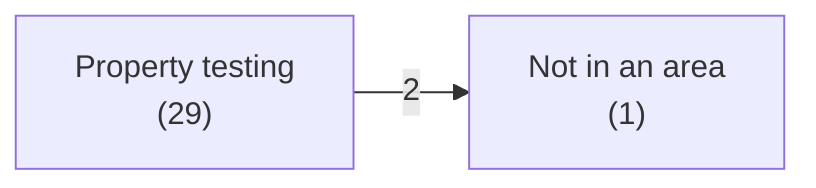
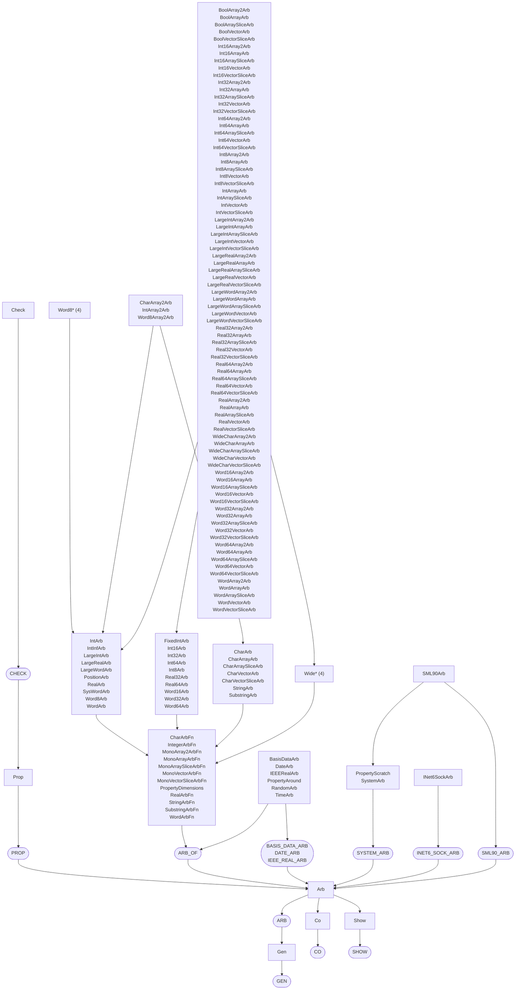

# What depends on what

[Property testing](README.md)

A node is one file of the library, named by the modules it declares; a family of structures that
one file declares, such as the five of `Int8`, is one node. An arrow from one node to another
means that the first needs the second to compile, as the library's MANIFEST records it. An arrow
that a path of other arrows already implies is left out, so that what is left is the shape of the
library and not a wall of lines: the 68 requirements between the 30 files become 35 arrows.
The order in which the MANIFEST loads the files makes the graph acyclic: every arrow points at a
file that is compiled earlier.

A rounded node declares signatures, a square one structures. The library writes its structures
first and the signatures of the specification after them, so an arrow from a signature to a
structure means that the signature's text names that structure's types, as `STREAM_IO` names
those of `TextPrimIO`; the structure is bound to the signature later still, in a seal file, which
is no part of this graph.

## The areas

How the areas of the library rest on each other; the number on an arrow is how many files of the
one need a file of the other.

## Not in an area

## Property testing

It also needs Not in an area (2).

---

Generated by runedoc from the MANIFEST; do not edit.
